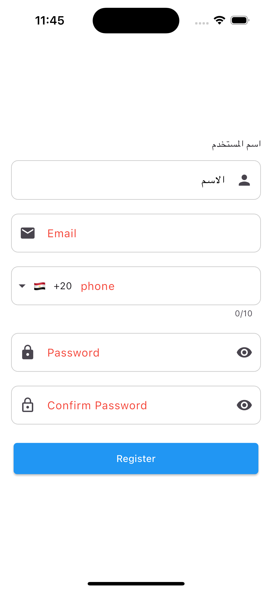
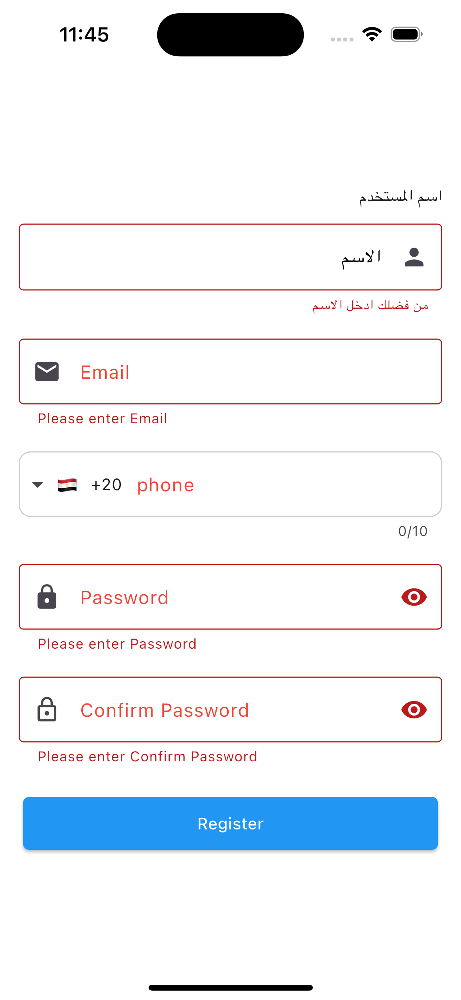
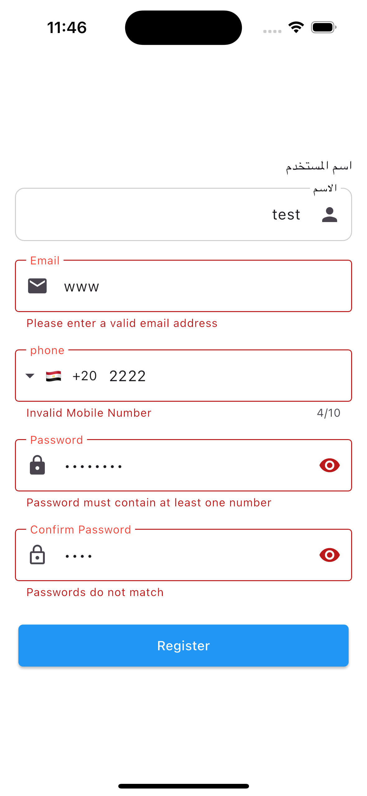
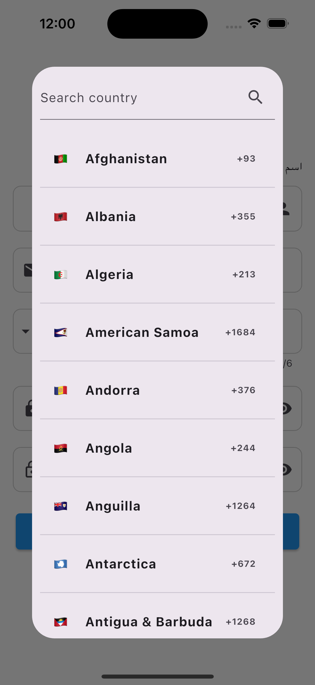
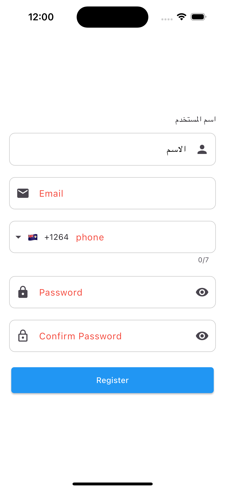

# CustomFormW

A flexible and customizable form widget for Flutter that allows for dynamic form creation with validation, custom labels, styling, and more.


## Screenshots

Here are some screenshots of the application:

| Screenshot 1 | Screenshot 2 |
|-------------|-------------|
|  |  |
| Screenshot 3 | Screenshot 4 |
|  |  |
| Screenshot 5 |
|  |

## Features
- Create dynamic forms with customizable text fields
- Add informational or instructional text before each field
- Allow users to add their own custom text above fields
- Highlight required fields with visual indicators
- Customize field labels, hints, and styles
- Support multiple input types (text, email, password, phone, number)
- Built-in validation for required fields, emails, passwords, and phone numbers
- Configurable submit button with custom text, color, and action
- Customizable border styles and form layout
- Optional submit button visibility
- Optional validation snackbar
- Password confirmation validation
- RTL language support

## Parameters

### Main Form Parameters
- **children** (Required): List of CustomTextField widgets
- **formKey** (Optional): A GlobalKey<FormState> for form validation
- **buttonText** (Optional): Text for the submit button (default: 'Submit')
- **buttonColor** (Optional): Color for the submit button (default: Colors.blue)
- **buttonTextStyle** (Optional): Style for the submit button text (default: TextStyle(color: Colors.white))
- **onSubmit** (Optional): Callback function for form submission
- **showButton** (Optional): Whether to show the submit button (default: true)
- **spacing** (Optional): Spacing between fields (default: 10.0)
- **validationSnackBarText** (Optional): Text for the validation snackbar (default: 'Form is valid')
- **showValidationSnackBar** (Optional): Whether to show the validation snackbar (default: true)
- **padding** (Optional): Padding for the form (default: EdgeInsets.symmetric(horizontal: 16))
- **buttonShape** (Optional): Custom Shape for your button

### CustomTextField Parameters
- **label** (Optional): Label text for the field
- **hint** (Optional): Hint text for the field
- **controller** (Optional): TextEditingController for managing text input
- **isRequired** (Optional): Whether the field is required (default: false)
- **type** (Optional): Type of field (text, email, password, phone, number) (default: CustomTextFieldType.text)
- **withoutLavel** (Optional): Whether to show a label or not (default: false)
- **textDirection** (Optional): Text direction for the field (default: TextDirection.ltr)
- **fillColor** (Optional): Background color for the field (default: Colors.white)
- **prefixIcon** (Optional): Icon to show at the start of the field
- **suffixIcon** (Optional): Icon to show at the end of the field
- **labelStyle** (Optional): Style for the label text
- **requiredColor** (Optional): Color for required field indicator (default: Colors.red)
- **labelColor** (Optional): Color for label text (default: Colors.black)
- **radius** (Optional): Border radius for the field (default: 10.0)
- **enabledBorderColor** (Optional): Color for the field border when enabled
- **focusedBorderColor** (Optional): Color for the field border when focused
- **hintStyle** (Optional): Style for the hint text
- **phoneRegex** (Optional): Regex for phone number validation (default: r'^\d{10}$')
- **phoneRegexError** (Optional): Error message for phone number validation
- **passwordLength** (Optional): Minimum length for password validation (default: 8)
- **isConfirmPassword** (Optional): Whether this field is for password confirmation (default: false)
- **headerText** (Optional): Text to display above the field
- **headerTextStyle** (Optional): Style for the headerText
- **crossAxisOfHeaderText** (Optional): Space between headerText and TextField
- **readOnly** (Optional): Make the textField readOnly
- **visibiltyColor** (Optional): Make Custom color for your visibilty icon 
- **contentPadding** (Optional): Make Custom padding for your TextField
- **showCountryFlag** (Optional): Show country flag for phone number input (default: true)
- **dropDownIcon** (Optional): Custom icon for dropdown (default: Icons.arrow_drop_down)
- **maxLines** (Optional): Custom maxLines
- **maxLenght** (Optional): Custom maxLenght


## Installation

Add this to your `pubspec.yaml` file:

```yaml
dependencies:
  custom_form_w: ^2.0.7
```
## Then run 
`flutter pub get`

